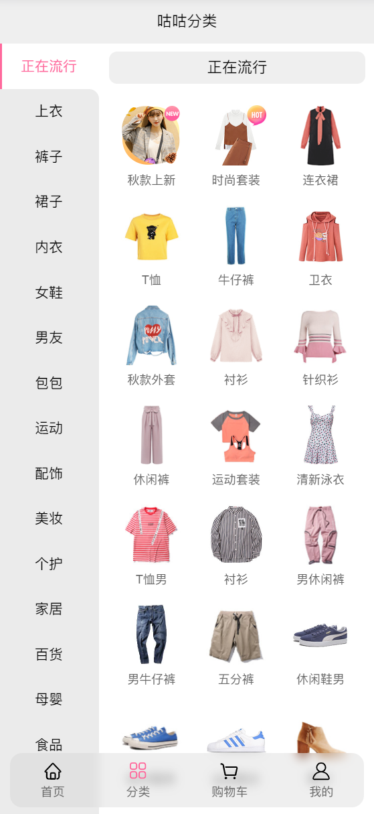
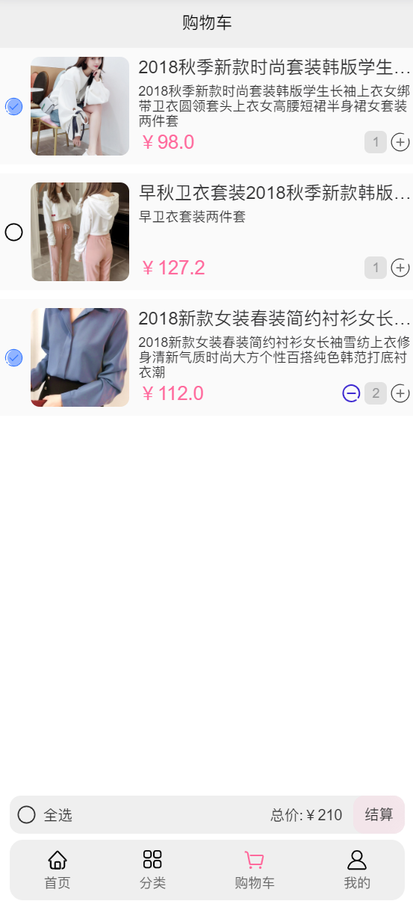

<h1 style="text-align: center;">咕咕街</h1>

<div style="text-align: center;">
  
  
  
  
</div>

<p style="text-align: center;">HY 老师的教学项目 <a href="https://github.com/coderwhy/supermall">supermall</a> 的重制版🎨</p>

<div>
    
</div>

## 预览

[Demo🎃](https://demo.defectink.com/gugu/) | [Demo on Netlify](https://gugu.rua.plus)

用的一些技术都是比较激进的，也就没有考虑兼容旧的浏览器了，顺便用上了原生滚动。在事件监听方面，也尽可能的使用了事件代理尝试提示性能。

样式相比较有些变化，根据自己的喜好和需要练手的目的来更改的，不一定非常好看。

尝试了一些新的技术：

* Vue3
* TypeScript
* SCSS

特性（应该）：

* localStorage 持久化存储购物车
* 原生滚动
* 懒加载
* 动画
* 字体子集处理
* 尽可能少的事件监听器

后端 API 同时也借鉴(~~扒~~)了一份：👉[gugumall-backend](https://github.com/DefectingCat/gugumall-backend)

## 本地部署

yarn or npm

### Project setup

```bash
yarn 
# or
npm install
```

### dev

```bash
yarn serve
# or 
npm run serve
```

### build

```bash
yarn build
# or 
npm run build
```

后端服务器带宽高达 1 Mbps，随时可能会挂。


## ToDo

- [x] 分类页面滚动
- [x] 分类页面 list 小圆角
- [x] 首页子组件切换保留滚动位置
- [x] 每周推荐使用 Grid 布局
- [x] 逻辑抽离
- [ ] 用户登录
- [ ] 添加更多动画过渡
- [ ] ~~整体 UI 美化~~

## 也许未来会尝试的

- [ ] 使用 volar 为 SFC 做类型检查